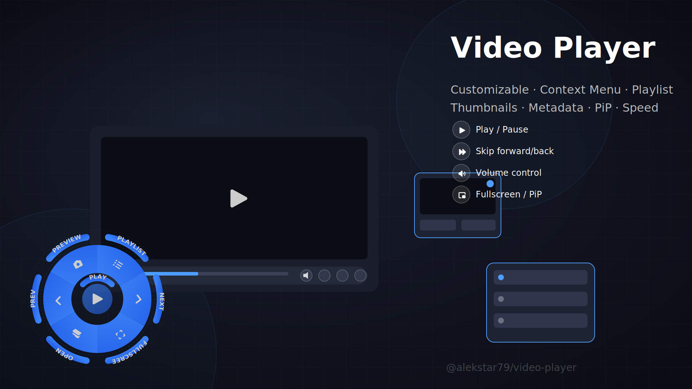

# Video Player TS (Vanilla/Vue3)

[](https://www.npmjs.com/package/@alekstar79/video-player)
[](LICENSE)
[](https://github.com/alekstar79/video-player)
[](https://www.typescriptlang.org)
[](https://github.com/alekstar79/video-player)

_A modern, feature-rich video player built with TypeScript and Web Components.
Supports native JavaScript and Vue 3 integration. Includes a customizable circular context menu,
playlist management, thumbnail generation, metadata extraction, and more._



**[View Live Demo](https://alekstar79.github.io/video-player)**

<!-- TOC -->
* [Video Player TS (Vanilla/Vue3)](#video-player-ts-vanillavue3)
  * [Features](#features)
  * [Installation](#installation)
  * [Usage](#usage)
    * [Vanilla JavaScript / TypeScript](#vanilla-javascript--typescript)
    * [Vue 3](#vue-3)
  * [Configuration](#configuration)
    * [Player Options (`VideoPlayerConfig`)](#player-options-videoplayerconfig)
    * [`VideoSource` Object](#videosource-object)
    * [`ControlsVisibility` (keys)](#controlsvisibility-keys)
  * [API](#api)
    * [Player Instance Methods](#player-instance-methods)
    * [Events (`PlayerEventMap`)](#events-playereventmap)
    * [Context Menu](#context-menu)
  * [Thumbnail Generation & Metadata](#thumbnail-generation--metadata)
    * [Metadata Extraction](#metadata-extraction)
    * [Preview Panel](#preview-panel)
    * [Programmatic Thumbnails](#programmatic-thumbnails)
  * [Styling and Customization](#styling-and-customization)
    * [Icons](#icons)
  * [Examples](#examples)
    * [Vanilla JS with dynamic source switching](#vanilla-js-with-dynamic-source-switching)
    * [Vue 3 – accessing player methods via ref](#vue-3--accessing-player-methods-via-ref)
    * [Listening to events](#listening-to-events)
    * [Building from Source](#building-from-source)
  * [License](#license)
<!-- TOC -->

## Features

- **Web Component based** – works with Vue3 framework or vanilla (JS / TS).
- **Vue 3 wrapper** – seamless integration with Vue 3 reactivity.
- **Configurable controls** – show/hide individual buttons, auto‑hide.
- **Playlist support** – multiple sources, next/previous navigation.
- **Loop modes** – none, single, all.
- **Picture‑in‑Picture** – if supported by the browser.
- **Fullscreen** – with custom controller and event handling.
- **Volume control** – horizontal/vertical orientation adapts to available space.
- **Timeline seeking** – hover preview and click seeking.
- **Playback speed** – selectable from predefined speeds.
- **Built‑in file opener** – uses modern File System Access API with fallback.
- **Thumbnail generation** – capture current frame, view details, save as JPEG.
- **MP4 metadata extraction** – title, artist, album, cover art.
- **Circular context menu** – powered by @alekstar79/context-menu (optional).
- **Event emitter** – subscribe to all player actions.
- **Fully typed** – written in TypeScript, includes type definitions.

## Installation

```bash
npm install @alekstar79/video-player
```

Optional peer dependencies (install only if needed):

```bash
npm install @alekstar79/context-menu   # for context menu
npm install vue                        # for Vue wrapper
```


## Usage

### Vanilla JavaScript / TypeScript

1. **Import the styles and register the custom elements**

```ts
import '@alekstar79/video-player/lib/styles.css'
import { registerComponents, createPlayer } from '@alekstar79/video-player'

// Register web components (required once)
registerComponents()
```
2. Create a container element in your HTML


```html
<div id="player-container"></div>
```

3. Initialize the player

```ts
const container = document.getElementById('player-container')

const player = await createPlayer(container, {
  initialSources: [
    'video.mp4',
    {
      title: 'My Video',
      url: 'https://example.com/vid.mp4',
      thumb: 'poster.jpg'
    }
  ],
  autoPlay: false,
  loopMode: 'all',
  contextMenu: true // enables default context menu
})
```

### Vue 3

```vue
<template>
  <VideoPlayer
    :initialSources="sources"
    :autoPlay="false"
    loopMode="all"
    :contextMenu="true"
    @play="onPlay"
    @timeupdate="onTimeUpdate"
  />
</template>

<script setup>
import { ref } from 'vue'
import { VideoPlayer } from '@alekstar79/video-player/vue'
import '@alekstar79/video-player/lib/styles.css'

const sources = ref([
  'video.mp4',
  { title: 'Big Buck Bunny', url: 'https://...', thumb: 'poster.jpg' }
])

function onPlay() { console.log('playing') }
function onTimeUpdate(data) { console.log(data.currentTime) }
</script>
```


## Configuration

### Player Options (`VideoPlayerConfig`)

| Option               | Type                                 | Default    | Description                                        |
|----------------------|--------------------------------------|------------|----------------------------------------------------|
| `initialSources`     | `(string \| Partial<VideoSource>)[]` | `[]`       | Array of video sources.                            |
| `container`          | `HTMLElement`                        | required   | Container element (only for `createPlayer`).       |
| `autoPlay`           | `boolean`                            | `false`    | Start playback immediately.                        |
| `initialVolume`      | `number`                             | `0.7`      | Initial volume (0–1).                              |
| `playbackRate`       | `number`                             | `1.0`      | Playback speed.                                    |
| `logging`            | `boolean`                            | `false`    | Enable console logs.                               |
| `loopMode`           | `'none' \| 'one' \| 'all'`           | `'none'`   | Loop behavior.                                     |
| `muted`              | `boolean`                            | `false`    | Start muted.                                       |
| `showControls`       | `boolean`                            | `true`     | Show/hide all controls.                            |
| `contextMenu`        | `boolean \| IConfig`                 | `false`    | Enable context menu with default or custom config. |
| `controlsVisibility` | `Partial<ControlsVisibility>`        | all `true` | Individual control visibility.                     |
| `maxWidth`           | `string \| number`                   | `'960px'`  | Maximum width of player.                           |
| `width`              | `string \| number`                   | –          | Explicit width.                                    |
| `height`             | `string \| number`                   | –          | Explicit height.                                   |
| `aspectRatio`        | `string`                             | `'16:9'`   | Aspect ratio (e.g. `'4:3'`).                       |
| `nextButton`         | `boolean`                            | `true`     | Show next source button (if multiple sources).     |
| `prevButton`         | `boolean`                            | `true`     | Show previous source button.                       |

### `VideoSource` Object

| Property      | Type                | Description                               |
|---------------|---------------------|-------------------------------------------|
| `title`       | `string`            | Display title.                            |
| `url`         | `string`            | Video URL.                                |
| `description` | `string` (optional) | Video description.                        |
| `thumb`       | `string` (optional) | Poster image URL.                         |
| `file`        | `File` (optional)   | File object (used when loaded from disk). |

### `ControlsVisibility` (keys)

| Key               | Description                         |
|-------------------|-------------------------------------|
| `showOpenFile`    | Show "Open file" button.            |
| `showPlayPause`   | Show play/pause button.             |
| `showSkipButtons` | Show skip forward/backward buttons. |
| `showVolume`      | Show volume control.                |
| `showTimeDisplay` | Show current time / duration.       |
| `showSpeed`       | Show speed selector.                |
| `showPip`         | Show Picture‑in‑Picture button.     |
| `showFullscreen`  | Show fullscreen button.             |
| `showLoop`        | Show loop mode button.              |
| `showTimeline`    | Show timeline/progress bar.         |


## API

### Player Instance Methods

After creating the player (via `createPlayer` or Vue ref), you can call:

| Method                                                                                             | Description                                         |
|----------------------------------------------------------------------------------------------------|-----------------------------------------------------|
| `play(): Promise<void>`                                                                            | Start playback.                                     |
| `pause(): void`                                                                                    | Pause playback.                                     |
| `togglePlay(): Promise<void>`                                                                      | Toggle play/pause.                                  |
| `toggleFullscreen(): Promise<void>`                                                                | Toggle fullscreen mode.                             |
| `togglePictureInPicture(): Promise<void>`                                                          | Toggle PiP (if supported).                          |
| `setVolume(volume: number): void`                                                                  | Set volume (0–1).                                   |
| `setMuted(muted: boolean): void`                                                                   | Mute/unmute.                                        |
| `setPlaybackRate(rate: number): void`                                                              | Set playback speed.                                 |
| `setLoopMode(mode: LoopMode): void`                                                                | Set loop mode.                                      |
| `toggleLoop(): void`                                                                               | Cycle loop modes (`none` → `one` → `all` → `none`). |
| `skip(seconds: number): void`                                                                      | Skip forward/backward.                              |
| `seekTo(time: number): void`                                                                       | Jump to specific time.                              |
| `setSources(sources: (string \| Partial<VideoSource>)[]): void`                                    | Replace playlist.                                   |
| `addSource(source: Partial<VideoSource>): void`                                                    | Add source to playlist.                             |
| `getSources(): VideoSource[]`                                                                      | Get all sources.                                    |
| `getCurrentSource(): VideoSource \| undefined`                                                     | Get current source.                                 |
| `getCurrentSourceIndex(): number`                                                                  | Get index of current source.                        |
| `nextSource(): Promise<void>`                                                                      | Switch to next source.                              |
| `previousSource(): Promise<void>`                                                                  | Switch to previous source.                          |
| `switchToSource(index: number): Promise<void>`                                                     | Switch to source by index.                          |
| `switchToSourceByUrl(url: string): Promise<void>`                                                  | Switch to source by URL.                            |
| `loadVideoFile(): Promise<void>`                                                                   | Open file picker and load video.                    |
| `loadVideoFromUrl(url: string): Promise<void>`                                                     | Load video from URL.                                |
| `showControls(): void`                                                                             | Show all controls.                                  |
| `hideControls(): void`	                                                                            | Hide all controls.                                  |
| `toggleControls(): void`                                                                           | Toggle controls visibility.                         |
| `showControl(key: keyof ControlsVisibility): void`                                                 | Show specific control.                              |
| `hideControl(key: keyof ControlsVisibility): void`                                                 | Hide specific control.                              |
| `toggleControl(key: keyof ControlsVisibility): void`                                               | Toggle specific control.                            |
| `setControlsVisibility(visibility: Partial<ControlsVisibility>): void`                             | Set multiple visibility flags.                      |
| `getControlVisibility(key: keyof ControlsVisibility): boolean`                                     | Get control visibility.                             |
| `getCurrentTime(): number`                                                                         | Get current playback time.                          |
| `getDuration(): number`                                                                            | Get video duration.                                 |
| `getVolume(): number`                                                                              | Get current volume.                                 |
| `getIsPlaying(): boolean`                                                                          | Check if playing.                                   |
| `getIsMuted(): boolean`                                                                            | Check if muted.                                     |
| `getPlaybackRate(): number`                                                                        | Get current playback rate.                          |
| `getLoopMode(): LoopMode`                                                                          | Get current loop mode.                              |
| `on<K extends keyof PlayerEventMap>(event: K, callback: (data: PlayerEventMap[K]) => void): void`  | Subscribe to event.                                 |
| `off<K extends keyof PlayerEventMap>(event: K, callback: (data: PlayerEventMap[K]) => void): void` | Unsubscribe from event.                             |
| `destroy(): void`                                                                                  | Clean up resources.                                 |


### Events (`PlayerEventMap`)

| Event                | Payload                                                                                                            | Description                                     |
|----------------------|--------------------------------------------------------------------------------------------------------------------|-------------------------------------------------|
| `play`               | `void`                                                                                                             | Playback started.                               |
| `pause`              | `void`                                                                                                             | Playback paused.                                |
| `ended`              | `void`                                                                                                             | Video ended.                                    |
| `timeupdate`         | `{ currentTime: number, duration: number, progress: number, formattedCurrent: string, formattedDuration: string }` | Time update.                                    |
| `volumechange`       | `{ volume: number, muted: boolean }`                                                                               | Volume or mute changed.                         |
| `playbackratechange` | `{ playbackRate: number }`                                                                                         | Speed changed.                                  |
| `fullscreenchange`   | `boolean`                                                                                                          | Fullscreen state changed (`true` = fullscreen). |
| `loadedmetadata`     | `void`                                                                                                             | Metadata loaded.                                |
| `error`              | `Error`                                                                                                            | An error occurred.                              |
| `sourcechanged`      | `number`                                                                                                           | Source index changed.                           |
| `loopmodechanged`    | `LoopMode`                                                                                                         | Loop mode changed.                              |
| `mounted`            | `void`                                                                                                             | Player instance mounted and ready.              |
| `context`            | `ISector`                                                                                                          | Context menu item clicked (sector data).        |

### Context Menu

The player integrates a circular context menu from [@alekstar79/context-menu](https://github.com/alekstar79/context-menu).
When enabled (contextMenu: true), right‑clicking on the player shows a menu with the following actions (depending on state):

- Play / Pause – central button icon toggles.
- Playlist – opens the playlist panel.
- Next / Previous – switch sources.
- Fullscreen – toggle fullscreen (icon changes).
- Open – open file dialog.
- Preview – open preview panel.

You can customize the menu by passing an IConfig object (see context‑menu documentation). Example:

```ts
import { defineConfig } from '@alekstar79/context-menu'

createPlayer(container, {
  contextMenu: defineConfig({
    sectors: [
      { icon: 'playlist', hint: 'My Playlist' },
      { icon: 'next', hint: 'Next', rotate: -90 },
      // ... your custom sectors
    ]
  })
})
```

## Thumbnail Generation & Metadata

### Metadata Extraction

When a file is loaded via the "Open file" button, the player automatically reads metadata from MP4 files using a built‑in parser. It extracts:

- Title (©nam)
- Artist (©art)
- Album (©alb)
- Cover art (covr)

The extracted title is displayed briefly when the source changes.

### Preview Panel

Click the **Preview** button (or use the context menu item) to open a draggable panel that shows:

- A snapshot of the current video frame.
- Resolution, timestamp, file size.
- A suggested filename (based on the video title or source name).
- Buttons to Generate a new snapshot (at the current time) and Save the snapshot as a JPEG file.

### Programmatic Thumbnails

For advanced use, you can import the thumbnail generator:

```ts
import { getThumbnails } from '@alekstar79/video-player/core/metadata'

const thumbnails = await getThumbnails(file, {
  interval: 5,   // seconds between thumbnails
  start: 0,
  end: 30,
  scale: 0.5,    // scale factor
  quality: 0.8
})
```

## Styling and Customization

- **CSS import**: `import '@alekstar79/video-player/lib/styles.css'` (required).
- The player uses **Shadow DOM** for its internal components, so its styles are encapsulated.
- You can still style the outer container (the custom element `<video-player>`) using normal CSS.
- For deep customisation, consider forking the repository and modifying the SCSS sources.

### Icons

The player expects an SVG sprite at `/icons.svg` (relative to your deployment root).
During the build, the file is copied from `public/icons.svg`. If you need a different location,
provide your own sprite or adjust the `IconHelper` logic.


## Examples

### Vanilla JS with dynamic source switching

```html
<div id="player"></div>
<button id="next">Next</button>

<script type="module">
  import '@alekstar79/video-player/lib/styles.css'
  import { registerComponents, createPlayer } from '@alekstar79/video-player'

  registerComponents()

  const container = document.getElementById('player')
  const player = await createPlayer(container, {
    initialSources: ['vid1.mp4', 'vid2.mp4'],
    loopMode: 'all'
  })

  document.getElementById('next').onclick = () => player.nextSource()
</script>
```

### Vue 3 – accessing player methods via ref

```vue
<template>
  <div>
    <VideoPlayer ref="playerRef" :initialSources="sources" />
    <button @click="toggle">Toggle Play</button>
  </div>
</template>

<script setup>
import { ref } from 'vue'
import { VideoPlayer } from '@alekstar79/video-player/vue'

const playerRef = ref()
const sources = ref(['video.mp4'])

function toggle() {
  playerRef.value?.togglePlay()
}
</script>
```

### Listening to events

```ts
player.on('timeupdate', (data) => {
  console.log(`Progress: ${(data.progress * 100).toFixed(1)}%`)
});

player.on('error', (err) => {
  console.error('Player error:', err)
})
```

### Building from Source

Clone the repository and install dependencies:

```bash
git clone https://github.com/alekstar79/video-player.git
cd video-player
npm install
```

| Script               | Description                                |
|----------------------|--------------------------------------------|
| `npm run dev`        | Start development server.                  |
| `npm run build`      | Build both library and demo.               |
| `npm run build:lib`  | Build only the library (output in `lib/`). |
| `npm run type-check` | Run TypeScript checks.                     |
| `npm run preview`    | Preview the built demo.                    |


## License
MIT © [alekstar79](https://github.com/alekstar79)
